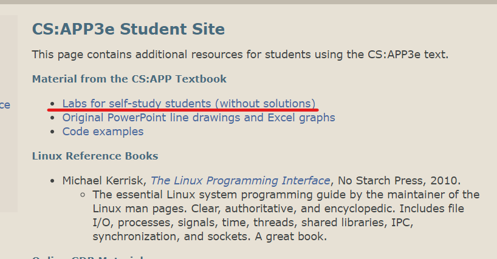
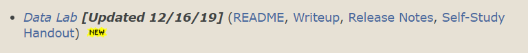
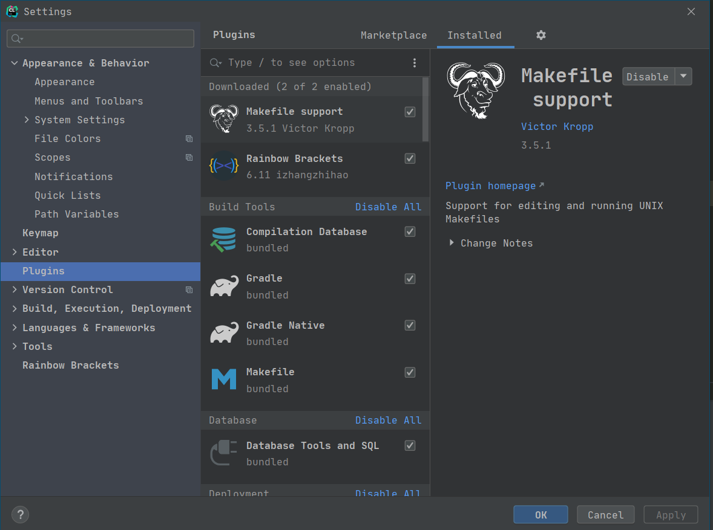
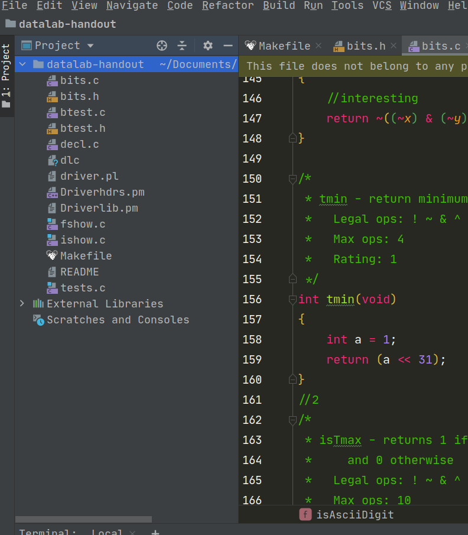
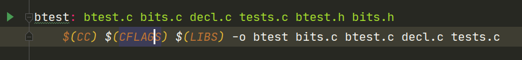

# CMU CS:APP3e学习-DataLab

>前提说明：我最近一直在学习CSAPP这门课，听两位教授讲课十分过瘾，也产生了一些心得。而在国庆期间无意看到了[@anarion](https://www.zhihu.com/people/anarion)大佬所写的学习笔记，深有感触，同时发现我和他的学习思路和使用工具(jetbrains,vscode,linux)都非常接近，于是也想把自己的心得和作业思路写成文章，分享在知乎上。
>我是一名普通的本科生，学这些课程只是出于自己的兴趣。我计划将这门课的学习写成一个专栏，算是一个对自己的监督，也是一个见证。

## 课程介绍

这门课程是卡内基梅隆大学的计算机基础课程，内容涵盖了计算机组成与体系结构，汇编，操作系统以及计算机网络等一些基础知识。相对应的那本深入理解计算机系统(csapp)的12个章节则对应着讲课的内容。建议大家可以去阅读这本书，内容十分详尽，就是一些特定的中文翻译可能不尽如人意。
我个人是以同时观看视频和阅读书籍的方式进行学习的。

## 课程资源

### 视频资源

[我所观看的视频资源](https://www.bilibili.com/video/BV1iW411d7hd)
这位up主精校的字幕还不错，是对我这样英语不好的人的福音~

### Lab资源

进入[CSAPP课程首页](http://csapp.cs.cmu.edu/3e/students.html)之后


- 点击红线，将进入[Lab汇总](http://csapp.cs.cmu.edu/3e/labs.html)
- 后面两个为上课时的PPT以及代码示例，由于我没用到，因此不作介绍了。

进入之后，下图为第一个作业，Data Lab的内容.

点击README可查看该作业的介绍；点击下载Self-Study Handout可获得源程序。

## 环境搭建

- [Ubuntu 20.04.1 LTS](https://cn.ubuntu.com/download)
- [CLion](https://www.jetbrains.com/clion/)
- CLion的Makefile support插件


之后用clion打开datalab-handout，即可开始完成作业啦。

## DataLab及相关内容

此课程的第一部分是Representing and Manipulating Information，即信息的表示与处理。
由于本章视频内容不难，看完B站视频的前三节我就开始写datalab了。
但datalab真的很难，我花了好一段时间，参考了很多别人的代码才算堪堪做完。现在我将选取我觉得很困难的一些问题在下面进行仔细分析。

**但首先的问题是怎么写这个lab。**

### 如何完成DataLab


可以看到datalab的内部文件组成，通过阅读README可以知道我们要填充的是`bits.c`(具体怎么填充请自行阅读),完成之后我们要做两件事。

1. 在clion自带的Terminal(当然也可以不用这个)中使用指令，没有任何反应则为正确

    ```shell
    ./dlc bits.c
    ```

2. 接着使用指令

    ```shell
    make btest
    ```

解释一下，dlc是一个专门的编译器，负责检查你所写的代码是否满足所规定的Legal ops和Max ops等规定，之后的make btest负责生成可执行文件btest，即检验你代码的正确性，包含你的每道题的错误和得分。
当然如果使用clion也可以进入Makefile文件直接点击左边的小三角运行。


之后输入

```shell
./btest
```

即可查看得分。

下面我挑选一些为认为具有一定难度或是特点的问题进行分析。

### DataLab题目分析

#### bitXor

```C++
/*
 * bitXor - x^y using only ~ and &
 *   Example: bitXor(4, 5) = 1
 *   Legal ops: ~ &
 *   Max ops: 14
 *   Rating: 1
 */
int bitXor(int x, int y)
{
    return ~((~x) & (~y)) & (~(x & y));
}
```

惭愧的说，第一个其实就难住了我，我差不多是凑出的这个结果，之后查了资料得知和摩尔根定律有关，
具体来说就是

```C++
~(~x & ~y) == x | y
```

而`x | y`和`~x | ~y`的并就是`x ^ y`，即可得到以上结果。

#### isTmax

```C++
/*
 * isTmax - returns 1 if x is the maximum, two's complement number,
 *     and 0 otherwise
 *   Legal ops: ! ~ & ^ | +
 *   Max ops: 10
 *   Rating: 1
 */
int isTmax(int x)
{
    return !(x + 1 + x + 1) & !!(x + 1);
}
```

应该说这个很简单，但我开始没有想到可以用`x + x`的方式来表达`x << 1`,因此浪费了不少时间。

#### allOddBits

```C++
/*
 * allOddBits - return 1 if all odd-numbered bits in word set to 1
 *   where bits are numbered from 0 (least significant) to 31 (most significant)
 *   Examples allOddBits(0xFFFFFFFD) = 0, allOddBits(0xAAAAAAAA) = 1
 *   Legal ops: ! ~ & ^ | + << >>
 *   Max ops: 12
 *   Rating: 2
 */
int allOddBits(int x)
{
    int tmp = 0xAA;
    tmp = (tmp << 8) + 0xAA;
    tmp = (tmp << 8) + 0xAA;
    tmp = (tmp << 8) + 0xAA;
    return !((tmp & x) ^ tmp);
}
```

这道题的核心在于用移位和加法来构造出`0xAAAAAAAA`，因为只有这个数是偶数位全为1，奇数位全为0，之后用任意的数和它做且运算，再用结果和它做异或运算即可分辨出两种数字。
由于数字大小限制，我使用了`0xAA`连续左移几次来达成这个目标。

#### howManyBits

```C++
/* howManyBits - return the minimum number of bits required to represent x in
 *             two's complement
 *  Examples: howManyBits(12) = 5
 *            howManyBits(298) = 10
 *            howManyBits(-5) = 4
 *            howManyBits(0)  = 1
 *            howManyBits(-1) = 1
 *            howManyBits(0x80000000) = 32
 *  Legal ops: ! ~ & ^ | + << >>
 *  Max ops: 90
 *  Rating: 4
 */
int howManyBits(int x)
{
    int a, b, c, d, e, f;
    int sign = x >> 31; //得到1或是0，用于处理负数
    x = (sign & ~x) | (~sign & x); //
    // 开始
    a = !!(x >> 16) << 4;//左边16位是否有1
    x = x >> a;//如果有，则将原数右移16位；若没有则不移动
    //第二轮
    b = !!(x >> 8) << 3;//不管左边16位是否有，此时只考虑留下的16位当中的左边8位
    x = x >> b;//如果有，则右移8位；若没有则不移动
    //第三轮
    c = !!(x >> 4) << 2;//之后同理
    x = x >> c;
    d = !!(x >> 2) << 1;
    x = x >> d;
    e = !!(x >> 1);
    x = x >> e;
    f = x;
    return a + b + c + d + e + f + 1;//+1表示加上符号位
}
```

这道题对我来说很复杂，
总之，我在注释中做了充分的解释

#### floatScale2

```C++
/*
 * floatScale2 - Return bit-level equivalent of expression 2*f for
 *   floating point argument f.
 *   Both the argument and result are passed as unsigned int's, but
 *   they are to be interpreted as the bit-level representation of
 *   single-precision floating point values.
 *   When argument is NaN, return argument
 *   Legal ops: Any integer/unsigned operations incl. ||, &&. also if, while
 *   Max ops: 30
 *   Rating: 4
 */
unsigned floatScale2(unsigned uf)
{
    unsigned s = uf & 0x80000000;//记录符号位，其余位置0
    unsigned exp = uf & 0x7f800000;//记录阶码，其余位置0
    unsigned frac = uf & 0x007fffff;//记录尾数，其余位置0
    if (!exp) //如果uf的阶码为0
    {
        frac <<= 1;


    }
    else if (exp ^ 0x7f800000) //如果阶码部分不为全1
    {
        exp += 0x00800000;//阶码加1，对于规格化数，相当于乘2
        if (!(exp ^ 0x7f800000))//如果加1后，阶码为全1，将尾数位全置0，返回值即是无穷大
        {
            frac = 0;
        }
    }
    /*对于阶码为在本身为全1的NaN，本函数没有对其进行操作，返回原数据，满足关卡要求*/
    return s | exp | frac;//将符号位，阶码位，尾数位通过按位异或结合起来
}
```

将frac左移一位，若尾数部分第一位为0，左移前后均为非规格化数，
尾数左移一位就相当于乘2;若尾数部分第一位为1，左移前为非规格化数，
左移后阶码部分由00000000变为00000001，阶码由1-127=-126(1-Bias)
变为e-127=1-127=-126(e-Bias),所得数为规格化数，尾数被解释为1+f,
相当于尾数乘2，阶码不变

#### floatFloat2Int

```C++
/*
 * floatFloat2Int - Return bit-level equivalent of expression (int) f
 *   for floating point argument f.
 *   Argument is passed as unsigned int, but
 *   it is to be interpreted as the bit-level representation of a
 *   single-precision floating point value.
 *   Anything out of range (including NaN and infinity) should return
 *   0x80000000u.
 *   Legal ops: Any integer/unsigned operations incl. ||, &&. also if, while
 *   Max ops: 30
 *   Rating: 4
 */
int floatFloat2Int(unsigned uf)
{
    int sign = (uf >> 31) & 1;
    //偏执量为127
    int exp = ((uf >> 23) & 255) - 127;
    int frac = uf & (~(511 << 23));
    //溢出过大
    if (exp > 31)
    {
        return 0x80000000u;
    }
    //exp小于0
    if (exp < 0)
    {
        return 0;
    }
    //frac加上默认的1
    frac += (1 << 24);
    //小于24，右移
    if (exp <= 24)
    {
        frac = frac >> (24 - exp);
        //大于24，左移
    }
    else if (exp <= 30)
    {
        frac = frac << (exp - 23);
    }
    //如果符号位为1，转负数
    if (sign)
    {
        frac = ~frac + 1;
    }
    return frac;
}
```
