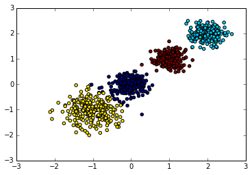

#! https://zhuanlan.zhihu.com/p/400026665
# 高基数类别型特征的处理方案记录

之前在做机器学习课的大作业时，我们组用到了2014年kaggle的点击率预测数据，于是我们特意参考了第二名的一个思路——mean encoding，我在这里把这个方法完整记录下来。
该思路的来源是一篇非常古老的2001年KDD论文：
[A Preprocessing Scheme for High-Cardinality Categorical Attributes in Classification and Prediction Problems](https://dl.acm.org/doi/abs/10.1145/507533.507538)

## 高基数类型特征的常见处理方法

mean encoding方法建立在一系列前提方法的基础之上。网络上已有相对完善的资料，我将其总结补充在这里介绍一下。

- one-hot encoder和label encoder
这两者是最机器学习领域最常见的定类变量预处理方法，不做过多介绍，可参考sklearn的[OneHotEncoder](https://scikit-learn.org/stable/modules/generated/sklearn.preprocessing.LabelEncoder.html)和[LabelEncoder](https://scikit-learn.org/stable/modules/generated/sklearn.preprocessing.LabelEncoder.html)文档。
然而在邮编、IP地址、家庭住址还有我们遇到的device_ip等等情况时，它们有着极多的类别数量。这些特征如果直接用独热编码将会产生无数新特征，处理起来在时间和内存上都无法接受；如果使用label encoder则又会暗含从0-N-1的数字顺序关系，这对于定类变量来说是毫无道理也会影响模型结果的。
那么针对高基数这一问题，一个常见的基于one-hot encoder的思路如下：
- clustering[1]
  - 将1到N（N非常大）的映射问题通过聚类转换为1到K(K<<N)
  - 然后再进行独热编码
  
  举个例子，家庭地址的数量，即使限制在一个小区内讨论数量也会极大，如果我们不按门牌号而是按照楼分类，比如把属于16号楼的所有住址全部设置为16号楼而不具体下去，那么这样一下就减少了大量的特征取值。然后再将所有的楼号通过独热编码变为N列，就完成了类别值到数值的转换。这也就是聚类的思路。

  

  然而这种做法导致了特征信息的丢失（本来有很多不同楼层、位置的具体细节，结果都看成一种一栋楼了）。

- smoothing
那么我们把这种clustering泛化一下，不要强迫为[1号楼、二号楼]（0、1）了，改成概率估计(0 ~ 1之间的小数、0 ~ 1之间的小数)，也就产生了smoothing。
平均数编码就是smoothing的一种实现。

值得一提的是，smoothing作为连续化标签的一种方式，在各种场合都很常见，比方说在做医疗数据时，一般情况下病人的各种病症(diagnosis code)是作为二值变量，需要被预测的。然而可以想见很多常见病症比如肥胖、之类的，是与否，只不过是判断其是否达到了一个设定好的阈值。于是当判断肥胖病人时，临近阈值和和刚过阈值显然差距不大，却在分类任务里被设置为了两类；临近阈值和数值很小的病人明显差距很大却被分为一类。解决这种问题的一个办法也就是smoothing，把离散数值变为连续数值，当然在此情况下做这样的转换需要专业的医疗知识。

## 算法思路

具体算法细节可以参考[知乎文章](https://zhuanlan.zhihu.com/p/26308272)，简要来说就是使用贝叶斯的方法。
记先验数据属于某一个 target 的数量, N 为先验数据总量。
先验概率：数据属于某一个 target(y) 的概率。
$$
\hat{P}(y=\operatorname{target})=\frac{\mathrm{C}(\mathrm{y}=\operatorname{target})}{\mathrm{N}}
$$
后验概率：该定性特征属于某一类时，数据点属于某一个 target(y) 的概率
$$
\hat{P}(\text { target }=y \mid \text { variable }=k)=\frac{C(y=\text { target } \cup \text { variabel }=\mathrm{k})}{C(\text { variable }=\mathrm{k})}
$$
得到了先验概率估计和后验概率估计后。最终编码所使用的概率估算，应当是先验概率与后验概率的一个凸组合（convex combination）。由此，我们引入先验概率的权重来计算编码所用概率：
$$
\hat{P}=\lambda \times \hat{P}(y=\operatorname{target})+(1-\lambda) \times \hat{P}(\text { target }=y \mid \text { variable }=k)
$$
我们需要定义一个权重函数，输入是特征类别在训练集中出现的次数 n ，输出是对于这个特征类别的先验概率的权重。假设一个特征类别的出现次数为 n ，以下是权重函数的一个例子：
$$
\lambda(n)=\frac{1}{1+e^{(n-k) / f}}
$$
这个权重函数的好处是一个特征类别在训练集内出现的次数越多，后验概率的可信度越高，其权重也越大。当$(freq_col - k) / f$太大的时候，np.exp可能会产生overflow的警告。我们不需要管这个警告，因为某一类别的频数极高，分母无限时，最终先验概率的权重将成为0，这也表示我们对于后验概率有充足的信任。

在我们的数据集中，由于数据是按时间顺序排列，所以我们的考虑方式是对于第N天的数据，用此天之前的数据算出先验概率，再结合当天的数据算出后验概率(第一天的数据记为0)

### 过拟合问题

除开我们的时序数据处理，还有一些其他训练平均数编码的方法，可以处理过拟合的问题，比如分成k份，每份内的特征值处理采用其他k-1份组成的数据集来训练平均数编码模型，再替换自己的值。

[1] http://www.bewindoweb.com/217.html | 三颗豆子

[2] https://zhuanlan.zhihu.com/p/26308272
